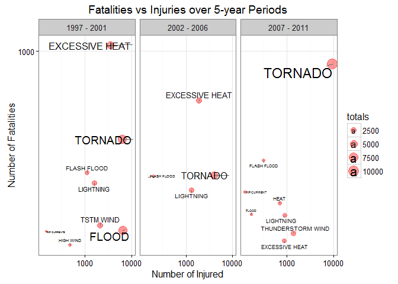
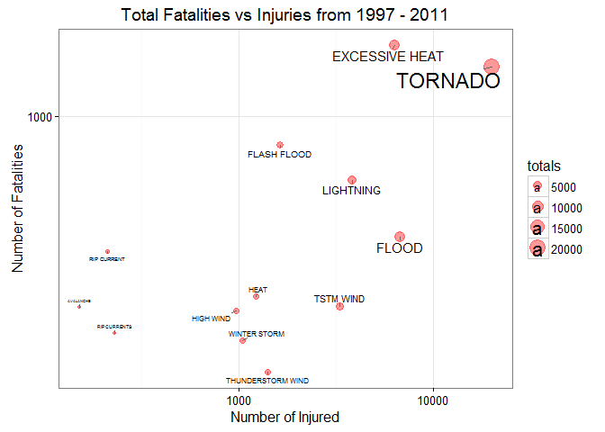
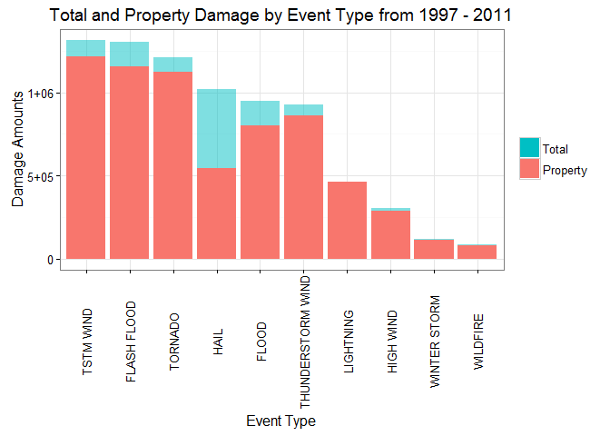

# US Weather Events and their Consequences on Population Health and Economics
Steffen Ruefer  
22 May 2016  


## Synopsis

The goal of this report is to understand which severe weather event across the United States cause the most damage to A) the population and B) the economy. We are looking at the NOAA Storm Database to identify the top 10 weather events causing the most damage in each category. To provide a reasonable accurate result, we will look only at the last 15 years of data; data goes back until 1950, however, over the last two decades our ability to record data accurately and cheaply has dramatically improved (approximately 2/3 of the available data is contained the most recent 15 years). Secondly, this is not a long term trend analysis of natural disasters. Instead the aim is to provide a concise picture of today's risks due to weather events. Hopefully this will help states, counties and communities to allocate the proper resources to mitigate such future risks.


## Data Processing

Prior to loading the data, the libraries required for data processing and plotting should be 
installed and loaded (not shown in this report).
These packages are: `dplyr`, `ggplot2`, `ggrepel`, `lubridate`. 


The original data is loaded from the compressed file directly into R for further processing:


```r
# Loading Data into R
x.raw <- read.csv("Data/repdata-data-StormData.csv.bz2")

# Print dimensions of raw dataset
dim(x.raw)
```

```
## [1] 902297     37
```

```r
# Subset dataset to relevant columns for population health investigation:
x <- select(x.raw,                                      # Data input from CSV
            BGN_DATE,                                   # Date of event
            EVTYPE,                                     # Event Type
            FATALITIES, INJURIES,                       # Number of fatalities and injuries
            PROPDMG, CROPDMG)                           # Economic damages
```

The original dataset has been reduced through subsetting. Only the variables containing the data to answer our questions have been kept. In the next pre-processing step, we introduce a new variable, `YEAR`, which we will use to filter the dataset. We will keep only the lastest 15 years of data.


```r
# Add year-only column and remove BGN_DATE
x$BGN_DATE <- mdy_hms(as.character(x$BGN_DATE))  # Convert date to POSIX
x <- mutate(x, YEAR = year(BGN_DATE))            # Add new column: YEAR (YYYY format)
x$BGN_DATE <- NULL                               # Remove original date column

# Look only at the most recent 15 years of data
x <- x %>% filter(YEAR > 1996)
```

Now the data has been reduced to the minimum amount required. Next we will add additional variables that will help with summarizing the data in a later step:

- **period**: A time period variable, splitting the data into three 5-year intervals
- **total_pop**: Total population damage
- **total_eco**: Total economic damage


```r
# Add 5-year time periods
periods <- c("1997 - 2001", "2002 - 2006", "2007 - 2011")
x$period <- periods[1]
x$period[x$YEAR >= 2002 & x$YEAR <= 2006] <- periods[2]
x$period[x$YEAR >= 2007] <- periods[3]
x$period <- factor(x$period)

# Add total impact for population and economy
x <- x %>%
     mutate(total_pop = INJURIES + FATALITIES,     # total damage = sum of damages
            total_eco = PROPDMG + CROPDMG)
```

Below shows the dataset summarized.


```r
glimpse(x)
```

```
## Observations: 621,260
## Variables: 9
## $ EVTYPE     (fctr) TSTM WIND, TSTM WIND, TSTM WIND, TSTM WIND, TSTM W...
## $ FATALITIES (dbl) 0, 0, 0, 0, 0, 0, 0, 0, 0, 0, 0, 0, 0, 0, 0, 0, 0, ...
## $ INJURIES   (dbl) 0, 0, 0, 0, 0, 0, 0, 0, 0, 0, 0, 0, 0, 0, 0, 0, 0, ...
## $ PROPDMG    (dbl) 6, 5, 0, 10, 5, 15, 3, 10, 6, 8, 4, 0, 18, 7, 4, 5,...
## $ CROPDMG    (dbl) 0, 0, 0, 0, 0, 2, 0, 0, 0, 0, 0, 0, 0, 0, 0, 0, 0, ...
## $ YEAR       (dbl) 1997, 1997, 1997, 1997, 1997, 1997, 1997, 1997, 199...
## $ period     (fctr) 1997 - 2001, 1997 - 2001, 1997 - 2001, 1997 - 2001...
## $ total_pop  (dbl) 0, 0, 0, 0, 0, 0, 0, 0, 0, 0, 0, 0, 0, 0, 0, 0, 0, ...
## $ total_eco  (dbl) 6, 5, 0, 10, 5, 17, 3, 10, 6, 8, 4, 0, 18, 7, 4, 5,...
```


### Weather Events most Harmful to Population

To look out for trends over the last 15 years, the data is processed further to summarize weather events over 5-year periods, as well as a consolidated, 15-year summary dataset. In this section, the data that will be used later for the data visualizations, is created for category A, population consequences.


```r
# Split data into 3 time periods, summarize and merge back together
pop1 <- data.frame()
for (p in periods) {
      # Create data frame from x dataset
      df <- x %>%
            filter(period == p) %>%
            group_by(EVTYPE) %>%
            summarise(fat_all = sum(FATALITIES), inj_all = sum(INJURIES), totals = sum(total_pop)) %>%
            filter(totals > 0) %>%
            mutate(period = p)
      
      # Combine / Merge
      if (length(pop1) == 0) {
            pop1 <- df
      } else {
            pop1 <- rbind(pop1, df)
      }
}

# Filter further and convert periods to factor variable
pop1 <- pop1 %>% filter(fat_all > 100, inj_all > 100)
pop1$period <- factor(pop1$period)
```

To reduce the number of events to the ones with the largest impact, filters are applied that filter out events that have low damage rates. The same filter is applied for the consolidated dataset.


```r
# Consolidated data - population consequences
pop2 <- x %>%
      group_by(EVTYPE) %>%
      summarise(fat_all = sum(FATALITIES), inj_all = sum(INJURIES), totals = sum(total_pop)) %>%
      filter(fat_all > 100, inj_all > 100)
```

The processed datasets are used to create a two plots, which will be shown later in the results section.


```r
# Plot 1: Facet Plot, showing data over 5-year periods (not printed here)
p1 <- ggplot(as.data.frame(pop1), aes(x = inj_all, y = fat_all, size = totals)) + 
      geom_point(color = "red", alpha = 0.4) +
      facet_grid(. ~ period) +
      scale_x_log10() +
      scale_y_log10() +
      ggtitle("Fatalities vs Injuries over 5-year Periods") +
      xlab("Number of Injured") +
      ylab("Number of Fatalities") +
      theme_bw() +
      geom_text_repel(data = filter(pop1, totals >= 100), aes(label = EVTYPE))

# Plot 2: Consolidated Bubble Chart
p2 <- ggplot(as.data.frame(pop2), aes(x = inj_all, y = fat_all, size = totals)) + 
      geom_point(color = "red", alpha = 0.4) +
      scale_x_log10() +
      scale_y_log10() +
      ggtitle("Total Fatalities vs Injuries from 1997 - 2011") +
      xlab("Number of Injured") +
      ylab("Number of Fatalities") +
      theme_bw() +
      geom_text_repel(data = filter(pop2, totals >= 100), aes(label = EVTYPE))
```


### Weather Events with Greatest Economic Consequences

For economic damages, the dataset is also processed further. This time, we will look at the two different type of damages and how they are distributed.


```r
# Summarize and arrange the economic data - by total economic damage
eco1 <- x %>% 
      group_by(EVTYPE) %>%
      summarise(crop_all = round(sum(CROPDMG),0), 
                prop_all = round(sum(PROPDMG),0), 
                totals = round(sum(total_eco),0)) %>%
      arrange(desc(totals))
```

These data are also combined into a single Figure, shown later in the results section.


```r
# Plot 4: Total Economic Damage
p4 <- ggplot(eco1[1:10,], aes(x = reorder(EVTYPE, -totals), y = totals, fill = "Total")) +
      geom_bar(stat = "identity", alpha = 0.5) +
      geom_bar(stat = "identity", aes(x = reorder(EVTYPE, -totals), y = prop_all, fill = "Property")) +
      theme_bw() +
      theme(axis.text.x = element_text(angle=90, vjust=0.5)) + 
      ggtitle("Total and Property Damage by Event Type from 1997 - 2011") +
      xlab("Event Type") +
      ylab("Damage Amounts") +
      scale_y_continuous(labels = abbreviate) +
      scale_fill_discrete(name="", guide = guide_legend(reverse = TRUE))
```


## Results

The processed data are now used to visualize our findings graphically. Tables, where needed, are also showing all or the required part of the data to explain the charts.

### Population Consequences Results

The weather events causing the highest damage amoung the population across the United States are shown in the table below:


```r
# Table of consolidated results
pop2 <- pop2 %>% arrange(desc(totals))
library(knitr)
kable(pop2[1:10,], col.names = c("Event Types", "Fatalities", "Injuries", "Total"))
```


Event Types          Fatalities   Injuries   Total
------------------  -----------  ---------  ------
TORNADO                    1485      19962   21447
EXCESSIVE HEAT             1761       6332    8093
FLOOD                       381       6740    7121
LIGHTNING                   598       3826    4424
TSTM WIND                   219       3305    3524
FLASH FLOOD                 795       1630    2425
THUNDERSTORM WIND           130       1400    1530
HEAT                        237       1222    1459
WINTER STORM                167       1042    1209
HIGH WIND                   211        970    1181

```r
print(p1)
```



*Figure-1: Fatalities vs. Injuries over 5-year periods from 1997 - 2011.*

Figure-1 shows that there are two weather events that cause the most number of fatalities: **Tornado** and **Excessive Heat**. In third place, when looking at total damages, comes **Flood**, though these cause less fatalities than **Lightning**, but many more injuries.


```r
print(p2)
```



*Figure-2: Consolidated Fatalities vs. Injuries from 1997 - 2011 by Severe Weather Events.*

Figure-2 confirms above interpretation; however it is notable that **Flood**, while being on third place, only occurred in the 1997-2001 period. In the 10 years afterwards, flooding appears but only resulting in minor damages to the population.


### Economic Damages Results

From the summary table below it is clear that the top three weather events for causing severe damages are **TSTM Wind**, **Flash Flood** and **Tornado**. The damage severity is declining linearly until **Lightning**, where it drops rapidly to approximately half of the next severe event. 


```r
kable(eco1[1:10,], col.names = c("Event Types", "Crop Damage", "Property Damage", "Total"))
```


Event Types          Crop Damage   Property Damage     Total
------------------  ------------  ----------------  --------
TSTM WIND                  98746           1215890   1314636
FLASH FLOOD               146418           1156462   1302880
TORNADO                    86111           1125792   1211903
HAIL                      473313            544038   1017351
FLOOD                     146402            803805    950207
THUNDERSTORM WIND          66663            862257    928920
LIGHTNING                   1852            463150    465002
HIGH WIND                  13872            290030    303901
WINTER STORM                1538            115809    117347
WILDFIRE                    4364             83007     87372

```r
print(p4)
```



*Figure-3: Total and Property Damage by Event Type from 1997 - 2011. The main damage is done to property (compared to damage to crops).*

Figure-3 shows that most of the damage is sustained by property. Only during **Hail** the damage amounts between property and crops are comparable.
